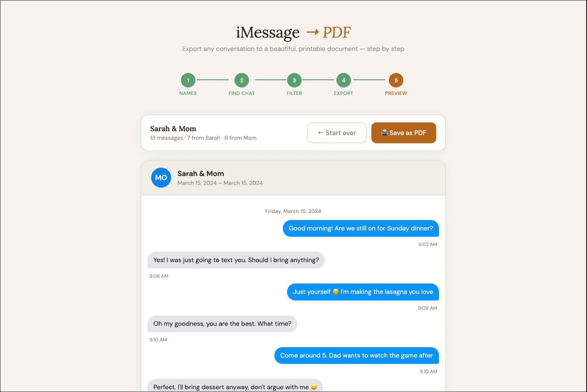

# iMessage → PDF

Export an iMessage conversation as a clean, readable PDF. Built for non-technical users.



---

## Why this exists

iMessage stores your full conversation history in a local SQLite database on your Mac. There's no built-in way to export a conversation as a document. Paid tools exist (iMazing, ~$35), but they require installation and trust.

This tool does one thing: turn a conversation into a readable PDF that looks like iMessage, runs entirely on your machine, and requires no installation.

---

## Setup

Before running the tool, two things need to be in place depending on your message source.

### Option A — Mac Messages (recommended)

Your Mac stores iMessage history at `~/Library/Messages/chat.db`. macOS gates access to this folder behind **Full Disk Access**:

1. Open **System Settings → Privacy & Security → Full Disk Access**
2. Toggle **Terminal** on
3. Restart Terminal if it was already open

That's it. One-time setup.

### Option B — iPhone backup

Use this if you want messages from your iPhone that aren't synced to your Mac, or if you don't have a Mac with Messages history.

**Create an unencrypted backup:**
1. Connect your iPhone to your Mac with a cable
2. Open **Finder** and click your device in the sidebar
3. Under Backups, select **"Back up all data on your iPhone to this Mac"**
4. Make sure **"Encrypt local backup" is unchecked**
5. Click **Back Up Now** and wait for it to complete

**Find the backup path** — run this in Terminal and paste the result into the app:
```bash
find ~/Library/Application\ Support/MobileSync/Backup -name "3d0d7e5fb2ce288813306e4d4636395e047a3d28" 2>/dev/null | head -1
```

> **Note:** The backup path contains a UUID that changes each time you create a new backup. If you make a new backup, re-run the find command to get the updated path.

---

## How it works

The app is a single HTML file you open in your browser. It walks you through five steps:

1. **Enter names** — who sent and who received (used only for display)
2. **Discover conversations** — run a one-line Terminal command that queries your Messages database and lists your conversations
3. **Pick a conversation** — select from the list, optionally filter by date range
4. **Extract messages** — run a generated Python command that reads the conversation from `~/Library/Messages/chat.db` (or an iPhone backup) and outputs it as plain text
5. **Preview and save** — paste the output, see a styled iMessage-style preview, then save as PDF via your browser's print dialog

The Python script is generated fresh each time based on your selections — nothing is stored, sent anywhere, or logged.

---

## Design decisions

**Single HTML file, zero install.**
The target user is not technical. An app they download and run is a barrier; a file they double-click is not. All logic — UI, step flow, message rendering, PDF generation — lives in one file.

**Python runs locally, reads SQLite directly.**
iMessage's `chat.db` is a standard SQLite database. The app generates a Python 3 script (available by default on every Mac) that queries it and prints pipe-delimited output. No third-party libraries required on the user's machine.

**attributedBody binary parsing.**
Newer iOS versions store message text in a binary NSArchiver format (`attributedBody`) rather than the plain `text` column. The generated Python script parses this format — handling the streamtyped header, variable-length little-endian integer encoding, DataDetector garbage filtering, and the U+FFFC object-replacement placeholder that iMessage inserts for attachment-only messages. This is the hard part; it took real work to get right.

**Browser print via popup window.**
PDF generation uses the browser's native print dialog (`window.print()` on a blob URL), not a library. No CDN dependency for PDF creation, no file size limits, no rendering quirks. The user changes "Destination" to "Save as PDF" in Chrome, or clicks "PDF → Save as PDF" in Safari.

**Attachments are labeled, not embedded.**
Photos, videos, and audio messages appear as `[Photo]`, `[Video]`, `[Audio Message]` in the PDF. Extracting and embedding actual media from a backup is a meaningful scope increase and was out of scope for v1.

**Full Disk Access — explained in-app.**
macOS gates `~/Library/Messages` behind Full Disk Access. The app explains exactly where to grant it (System Settings → Privacy & Security → Full Disk Access → Terminal) at the step where it's needed, before the user runs any command.

**Built with AI assistance.**
This tool was built collaboratively with Claude (Anthropic). The design decisions, UX flow, and scope choices documented here are mine. The hard technical pieces — especially the binary attributedBody parser — were debugged iteratively using real diagnostic output.

---

## Limitations

- **Mac only** for the Terminal extraction path. The manual paste path works anywhere Messages is accessible.
- **Requires Terminal** for the automatic extraction. A non-technical user will need brief guidance the first time.
- **Full Disk Access** must be granted to Terminal (one-time setup).
- **Attachments not embedded** — photos and media appear as labels only.
- **Google Fonts** loads on first use for typography (Lora + DM Sans). The app falls back to system fonts if offline.
- **iPhone backups must be unencrypted.** If you use an encrypted iTunes/Finder backup, you'll need to create an unencrypted one.

---

## Roadmap

- Embed photos and images from iPhone backups directly into the PDF
- AppleScript/Automator wrapper to eliminate the Terminal step entirely
- Windows/Linux support (the Python script is cross-platform; the UI guidance is Mac-specific)

---

## License

MIT — see [LICENSE](LICENSE).
